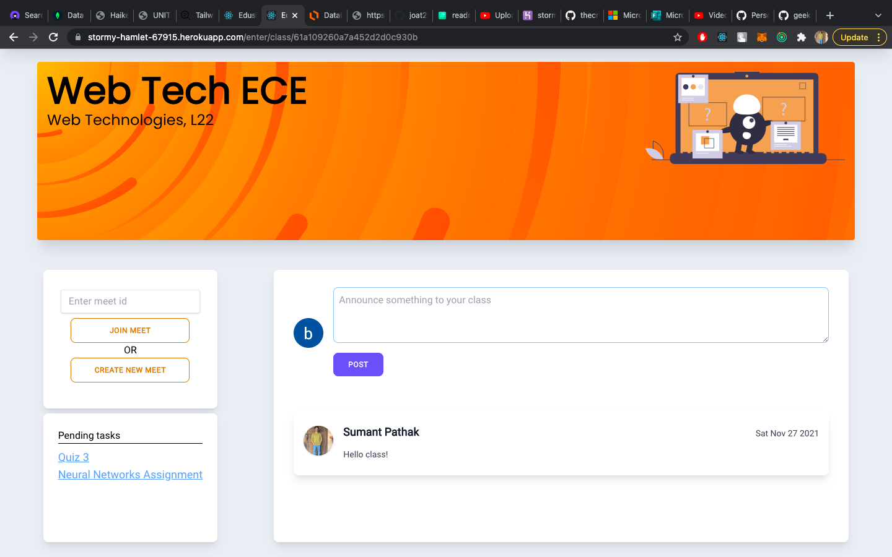

# Edushare

One stop application to easily manage your classroom.
As an instructor, create as many classes to manage
grading and assignments in an easy way.
As a student, join all the classes you want to, keep track of assignments easily.

Link to deployed app: [https://stormy-hamlet-67915.herokuapp.com](https://stormy-hamlet-67915.herokuapp.com)

See the video demo here: [https://www.youtube.com/watch?v=OE_pIxRdlno](https://www.youtube.com/watch?v=OE_pIxRdlno)

#### Edushare Features:

- Create MCQ Quizzes easily and let our app auto-grade all the submissions. You can also view individual student's submissions.
- Easily share and grade file based assignments, also allowing you to view each students' submissions.
- Peer-to-Peer online video call facility for taking online classes easily. Create or join video calls with ease.
- Sign in easily using your Google Account.

## Tech Stack [MERN]

#### Frontend

- Frontend Framework: `React.js, Redux`
- Styling: `Tailwind CSS`

#### Backend

- Server: `Express.js (Node.js Framework)`
- Database: `MongoDB`
- API testing: `POSTMAN`
- Authentication: `Google OAuth & JWT`
- File Storage: `AWS S3`
- Video Calling : `WebRTC, Socket.io`

#### CI/CD

- Heroku

## ER Diagram

- User can create as many classes as they want. By default, whosoever creates the class is the teacher and the one who joins, is the student.
- Teacher can create as many MCQ quizzes and file based assignments.
- Students can make their individual submissions on MCQ/assignments.


## Application Setup Guidelines

1. Clone the project

   ```
   git clone https://github.com/geekysumant/edushare-ms-engage-2021.git
   ```

2. Create a `.env` file in `/backend` folder, and setup [Environment Variables](environment-variables).

   ```
   MONGO_URI          : MongoDB connection string
   JWT_SECRET_KEY     : Secret key for signing JWT
   GOOGLE_CLIENT_ID   : Google client ID for Google OAuth
   AWS_BUCKET_NAME    : AWS S3 Bucket Name
   AWS_BUCKET_REGION  : AWS S3 Region, e.g. us-east-1
   AWS_ACCESS_KEY     : AWS S3 access key
   AWS_SECRET_KEY     : AWS S3 secret key

   ```

3. Create a `.env` file in `/client` folder, and setup [Environment Variables](environment-variables).

   ```
   REACT_APP_GOOGLE_CLIENT_ID   : Google client ID for Google OAuth
   ```

4. Run these commands then -
   ```
   npm install
   cd client
   npm install
   ```
5. To start the client and the server
   ```
   npm run server
   cd client
   npm start
   ```

## API Reference

### Login API

- #### Login exising/new user

```http
  POST /api/v1/login
```

### Classes API

- #### Create new class

```http
  POST /api/v1/class/create
```

| Request body | Type     | Description                           |
| :----------- | :------- | :------------------------------------ |
| `className`  | `string` | **Required**. Name of class to create |
| `subject`    | `string` | **Required**. Name of subject         |
| `room`       | `string` | **Required**. Room                    |

- #### Fetch classes

```http
  GET /api/v1/class/fetch
```

| Description |
| :---------- |

Fetches all classes joined/created by the user

- #### Fetch a class

```http
  GET /api/v1/class/fetch/${classId}
```

| Parameter | Type     | Description                                    |
| :-------- | :------- | :--------------------------------------------- |
| `classId` | `string` | **Required**. ID of class to fetch its details |

- #### Join a class

```http
  POST /api/v1/class/join
```

| Request Body | Type     | Description                           |
| :----------- | :------- | :------------------------------------ |
| `classId`    | `string` | **Required**. ID of the class to join |

- #### Fetch users in a class

```http
  GET /api/v1/class/fetch/users/${classId}
```

| Parameter | Type     | Description                                            |
| :-------- | :------- | :----------------------------------------------------- |
| `classId` | `string` | **Required**. ID of class to fetch users in that class |

### Announcement API

- #### Create new announcement

```http
  POST /api/v1/announcement/create/${classId}
```

| Parameter | Type     | Description                                                   |
| :-------- | :------- | :------------------------------------------------------------ |
| `classId` | `string` | **Required**. Class ID in which announcement is to be created |

- #### Fetch announcements

```http
  POST /api/v1/announcement/fetch/${classId}
```

| Parameter | Type     | Description                                                     |
| :-------- | :------- | :-------------------------------------------------------------- |
| `classId` | `string` | **Required**. Class ID in which announcements are to be fetched |

- #### Delete announcement

```http
  DELETE /api/v1/announcement/delete/${announcementId}
```

| Parameter | Type     | Description                                    |
| :-------- | :------- | :--------------------------------------------- |
| `classId` | `string` | **Required**. ID of announcement to be deleted |

### MCQ Quiz API

- #### Create new MCQ Quiz

```http
  POST /api/v1/quiz/create
```

| Request Body | Type     | Description                                           |
| :----------- | :------- | :---------------------------------------------------- |
| `classId`    | `string` | **Required**. Class ID in which quiz is to be created |
| `questions`  | `string` | **Required**. Array of questions                      |
| `title`      | `string` | **Required**. Quiz title                              |

- #### Fetch all MCQ Quizzes and Assignments in a class

```http
  GET /api/v1/quiz/fetch/all/${classId}
```

| Parameter | Type     | Description                                                               |
| :-------- | :------- | :------------------------------------------------------------------------ |
| `classId` | `string` | **Required**. Class ID in which quizzes and assignments are to be fetched |

- #### Fetch all pending quizzes for a student

```http
  GET /api/v1/quiz/fetch/pending/${classId}
```

| Parameter | Type     | Description                                                                       |
| :-------- | :------- | :-------------------------------------------------------------------------------- |
| `classId` | `string` | **Required**. Class ID in which pending quizzes are to be fetched for the student |

- #### Fetch an MCQ Quiz

```http
  GET /api/v1/quiz/fetch/${quizId}
```

| Parameter | Type     | Description                                |
| :-------- | :------- | :----------------------------------------- |
| `quizId`  | `string` | **Required**. ID of MCQ Quiz to be fetched |

- #### Submit an MCQ Quiz (for students)

```http
  POST /api/v1/quiz/submit
```

| Request Body | Type     | Description                                              |
| :----------- | :------- | :------------------------------------------------------- |
| `quizId`     | `string` | **Required**. ID of MCQ Quiz that is submitted           |
| `submission` | `string` | **Required**. Array of questions and their chosen option |

- #### Fetch all submissions made on a particular MCQ Quiz (for teachers)

```http
  GET /api/v1/quiz/submissions/${quizId}
```

| Parameter | Type     | Description                                           |
| :-------- | :------- | :---------------------------------------------------- |
| `quizId`  | `string` | **Required**. ID of MCQ Quiz to fetch all submissions |

- #### View a particular MCQ Quiz submission

```http
  GET /api/v1/quiz/submission?quizId=${quizId}&userId=${userId}
```

| Query Parameters | Type     | Description                                                                                   |
| :--------------- | :------- | :-------------------------------------------------------------------------------------------- |
| `quizId`         | `string` | **Required**. ID of MCQ Quiz to fetch given users submission                                  |
| `userId`         | `string` | User ID to fetch their submission. Required if a teacher wants to view a student's submission |

### Assignment API

- #### Create new file based assignment

```http
  POST /api/v1/assignment/create
```

| Request Body   | Type                 | Description                                                |
| :------------- | :------------------- | :--------------------------------------------------------- |
| `file`         | `multipart/formdata` | **Required**. Assignment file to be shared in class        |
| `classId`      | `string`             | **Required**. Class ID in which assignment is to be shared |
| `title`        | `string`             | **Required**. Assignment title                             |
| `instructions` | `string`             | Assignment instructions                                    |
| `marks`        | `string`             | **Required**. Marks for assignment                         |

- #### Fetch an assignment

```http
  GET /api/v1/assignment/fetch/${assignmentId}
```

| Request Body   | Type     | Description                             |
| :------------- | :------- | :-------------------------------------- |
| `assignmentId` | `string` | **Required**. ID of assignment to fetch |

- #### Fetch all pending assignments for a student

```http
  GET /api/v1/assignment/fetch/pending/${classId}
```

| Request Body | Type     | Description                                                                           |
| :----------- | :------- | :------------------------------------------------------------------------------------ |
| `classId`    | `string` | **Required**. Class ID in which pending assignments are to be fetched for the student |

- #### Submit an assignment (for students)

```http
  POST /api/v1/assignment/submit
```

| Request Body   | Type                 | Description                                                      |
| :------------- | :------------------- | :--------------------------------------------------------------- |
| `assignmentId` | `string`             | **Required**. ID of assignment on which submission is to be made |
| `classId`      | `string`             | **Required**. ID of class in which assignment is shared          |
| `file`         | `multipart/formdata` | **Required**. Assignment submission file uploaded by students    |

- #### Fetch all submissions for an assignment (for teachers)

```http
  GET /api/v1/assignment/submissions/${assignmentId}
```

| Request Body   | Type     | Description                                                        |
| :------------- | :------- | :----------------------------------------------------------------- |
| `assignmentId` | `string` | **Required**. ID of assignment whose submissions are to be fetched |

- #### Fetch a particular submission

```http
  GET /api/v1/assignment/submission?assignmentId=${assignmentId}&userId=${userId}
```

| Request Body   | Type     | Description                                                                                          |
| :------------- | :------- | :--------------------------------------------------------------------------------------------------- |
| `assignmentId` | `string` | **Required**. ID of assignment whose submission is to be fetched                                     |
| `userId`       | `string` | **Required** ID of user whose submission to fetch. Only teacher can view other student's submission. |

- #### Grade student's submission

```http
  POST /api/v1/assignment/grade
```

| Request Body   | Type      | Description                                                     |
| :------------- | :-------- | :-------------------------------------------------------------- |
| `assignmentId` | `string`  | **Required**. ID of assignment whose submission is to be graded |
| `userId`       | `string`  | **Required** ID of user whose submission to grade               |
| `grade`        | `Integer` | **Required** The integer grade awarded to the submission        |

- #### Fetch file extension of uploaded assignment

```http
  GET /api/v1/assignment/getFileExtension/${assignmentId}
```

| Request Body   | Type     | Description                                                                                                                                                 |
| :------------- | :------- | :---------------------------------------------------------------------------------------------------------------------------------------------------------- |
| `assignmentId` | `string` | **Required**. ID of assignment to fetch file extension of uploaded file in the assignment (needed for downloading file type in original uploaded extension) |

- #### Fetch file extension of uploaded assignment submission

```http
  GET /api/v1/assignment/submission/getFileExtension/${assignmentId}
```

| Request Body   | Type     | Description                                                                                                                                                 |
| :------------- | :------- | :---------------------------------------------------------------------------------------------------------------------------------------------------------- |
| `assignmentId` | `string` | **Required**. ID of assignment to fetch file extension of uploaded file in the submission (needed for downloading file type in original uploaded extension) |

- #### Download uploaded assignment file

```http
  GET /api/v1/assignment/download/${assignmentId}
```

| Request Body   | Type     | Description                                                  |
| :------------- | :------- | :----------------------------------------------------------- |
| `assignmentId` | `string` | **Required**. ID of assignment to download the attached file |

- #### Download uploaded assignment submission file

```http
  GET /api/v1/assignment/submission/download/${assignmentId}
```

| Request Body   | Type     | Description                                                             |
| :------------- | :------- | :---------------------------------------------------------------------- |
| `assignmentId` | `string` | **Required**. ID of assignment to download the attached submission file |

## CI/CD

Heroku was used for CI/CD. I aslo followed Agile Developement methodology. Wherein, I developed features step by step. This allowed me to test every feature added thoroughly and easily.
Agile development allows you to iteratively build a software one feature at a time.

## Screenshots

#### Features


#### All classes


#### Classroom Feed



#### Video Calling


#### Classwork


#### Take MCQ Quiz- For Student


#### Quiz Performance- For Student


#### View/Grade a student's assignment submission- For Teacher


#### View Assignment (Graded) - Student Screen


View more pictures here: [./screenshots](./screenshots)

## Developer

[](https://www.linkedin.com/in/geekysumant/)
